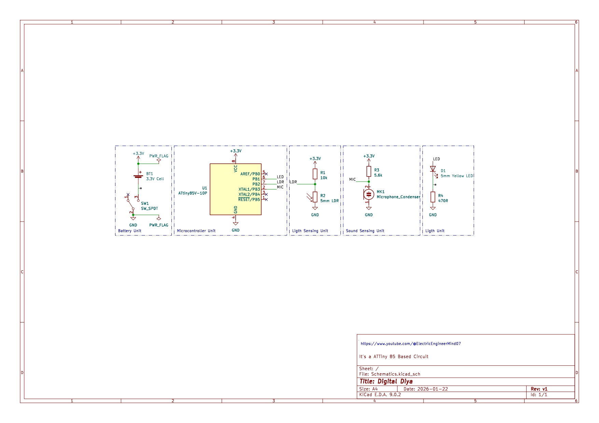
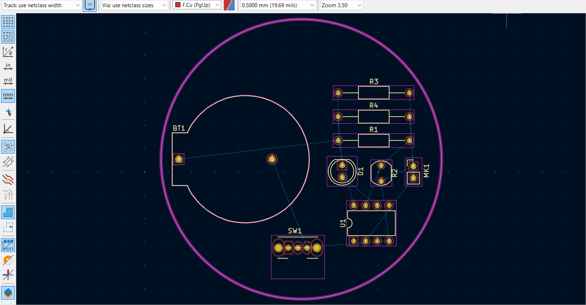
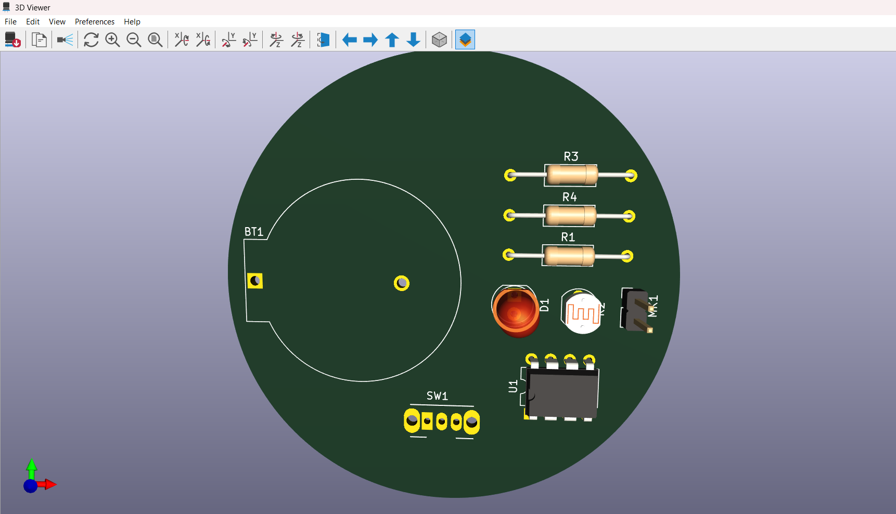
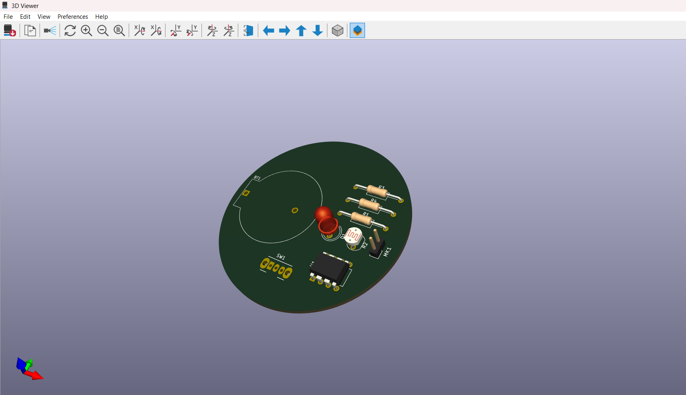

# 🪔 Digital Diya using ATtiny85 (KiCad 9.0)

**Digital Diya (Sound + Light Activated LED) using ATtiny85 – PCB Designed in KiCad 9.0**

---

## 📌 Project Overview

This project is a **Digital Diya** PCB designed in **KiCad 9.0**, which works like a smart diya/light.

It uses:
- **LDR07** to detect light/dark conditions  
- **Condenser Microphone** to detect sound (clap/blow)  
- **ATtiny85-10P** as the controller  
- **LED** as the diya light output  
- **Battery cell (3.3V)** for portable power  
- **SPDT switch** for ON/OFF control  

---

## ✨ Key Features

✅ Light-based activation using LDR  
✅ Sound-trigger input using microphone  
✅ Portable battery-powered circuit  
✅ Compact PCB layout in KiCad 9.0  
✅ Easy Gerber export for PCB manufacturing  

---

## 📸 Project Images

> Upload these images in the **assets/** folder with same filenames.

### ✅ Schematic


### ✅ PCB Layout


### ✅ 3D PCB View


### ✅ Final Output


---

## 🔌 Circuit Diagram (Block Diagram)

```text
      +-------------------------+
      |      Battery Cell       |
      |        (3.3V)           |
      +-----------+-------------+
                  |
              +---+---+
              | SPDT  |
              |Switch |
              +---+---+
                  |
         +--------+--------+
         |   ATtiny85-10P  |
         |  (Controller)   |
         +---+---------+---+
             |         |
         LDR07      Microphone
      (Light Sensor) (Sound Input)
             |
             +---------+
                       |
                     LED
               (Digital Diya)
---

🧩 Components Used (BOM)
Component	Quantity	Description
ATtiny85-10P	1	8-bit Microcontroller
LED	1	Output Diya Light
Resistor	2-3	LED + Sensor biasing
Condenser Microphone	1	Sound input sensor
LDR07	1	Light dependent resistor
Battery Cell	1	Power source
SPDT Switch	1	ON/OFF control
3.3V Supply	1	Power rail
GND	1	Ground reference

---

⚙️ Working Principle
✅ Light sensing (LDR07)
When it is dark, LDR resistance increases
ATtiny85 detects low light and turns LED ON
✅ Sound sensing (Microphone)
Microphone detects sudden sound (clap/blow/noise pulse)
ATtiny85 processes the signal
LED can toggle / brighten depending on firmware logic
✅ Switch Control
SPDT switch enables or disables the circuit manually

---

🔌 Pin Connections (Example Reference)
Pin mapping may differ based on your schematic.
ATtiny85 Pin	Connected To
VCC	3.3V
GND	GND
PB0 / PB1	LED control output
PB2 / PB3	Microphone input
PB4 / ADC	LDR input

---

📂 Project Folder Structure
PCB_Design_DD/
│── README.md
│── assets/
│   ├── schematic.png
│   ├── pcb_layout.png
│   ├── pcb_3d.png
│   └── final_output.jpg
│── KiCad_Files/
│   ├── Digital_Diya.kicad_pro
│   ├── Digital_Diya.kicad_sch
│   └── Digital_Diya.kicad_pcb
│── Gerber_Files/   (NA)
│   ├── *.gbr
│   └── *.drl

---

✅ How to Open in KiCad 9.0
Install KiCad 9.0
Open KiCad → File → Open Project
Select Digital_Diya.kicad_pro
Open: Schematic → Digital_Diya.kicad_sch
PCB → Digital_Diya.kicad_pcb

---

🏗️ How to Generate Gerber Files
Open PCB Editor
Go to File → Fabrication Outputs → Gerbers
Select layers
Click Generate
Export Drill files also

----

✅ Applications
Smart LED diya decoration
Sound-activated night lamp
Festival DIY electronics project
Embedded system mini project

---

👤 Author
Vivek Kumar Vishwakarma
